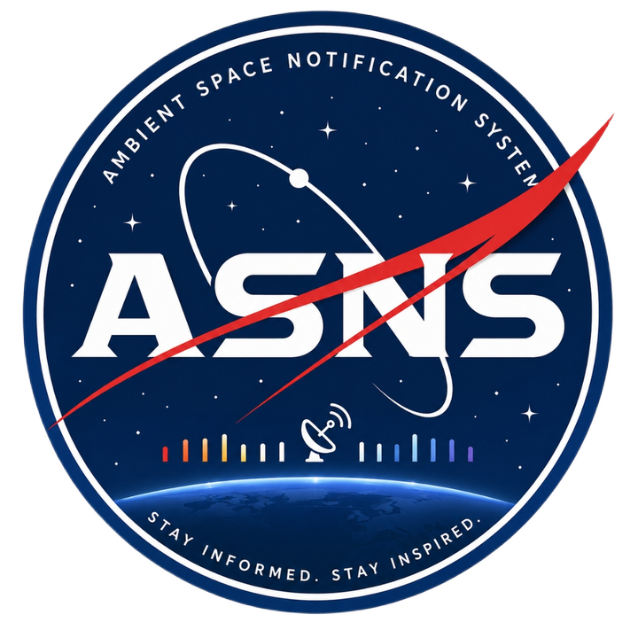

  

  # Ambient Space Notification System (ASNS)

  ### Stay informed. Stay inspired.

Ever been sitting at your desk and wondered what's happening in space right now? Most of us don't check NASA's website every hour — and if you do, that's honestly impressive.

ASNS is a desk companion that quietly keeps you connected to space. A wall-mounted LED strip runs subtle ambient lighting behind your desk, and shifts into short notification animations when something real happens — a solar flare, an ISS pass overhead, a shift in Earth's weather systems. No app to check, no feed to scroll. Just a glance at your wall.

A compact control unit sits on the desk — a 3D-printed, rounded 11.7 × 10.5 × 6 cm box housing the brains of the system, connected to the LED strip via JST connectors.

## How it works

- **ESP32-WROVER-IE** polls **Nova**, the AI backend, over HTTPS for space event data.
- **Nova** (built on Groq's `gpt-oss-120b`) pulls from NASA (DONKI, EONET), N2YO (live satellite/ISS telemetry), and Le Système Solaire (planetary data), then decides what's actually worth surfacing — since raw satellite data alone updates constantly, and without filtering it would drown out every other signal.
- A lightweight on-device filter also runs directly on the ESP32, recognizing 16 tracked satellites (ISS, Tiangong, Hubble, Terra, Aqua, and more) so simple, high-value events — like *"ISS visible in 5 minutes!"* — can trigger a notification animation without waiting on a full AI round-trip.
- To avoid free-tier cold starts on Render, the ESP32 sends a lightweight keep-alive ping roughly every 10 minutes, separate from its actual data requests (every 5 minutes).
- When nothing's happening, the **WS2812B strip** (5m, 300 LEDs) runs a user-selected ambient pattern — Deep Space, Starfield, Moonlight, Aurora, Mars Glow, Solar Wind — in warm, low-brightness tones so it's easy to leave running while working or studying.
- When something happens, the strip pauses ambient mode, plays a short notification animation for the relevant category (Mars, Earth, Moon, Sun, Saturn, Satellites), then fades back.

**Note:** the filtering logic above is implemented and live on both sides (Nova's `/sensor` endpoint and the ESP32 satellite filter) — see [Project Status](#project-status) for what's still pending on the hardware/UI side.

## Meet Nova

Nova isn't just a data pipeline — she's a warm, expressive AI with her own personality: playful and witty when you are, gentle and supportive when you're not, and unafraid to express herself with a bit of kaomoji flair. Today, she lives on Telegram, where she can hold a natural conversation, actually look at photos sent to her using Google Lens, and pull real-time space data on request — satellite telemetry, solar activity, planetary data, and image search.

She runs on Groq's `gpt-oss-120b`, exposed through a FastAPI `/chat` endpoint — the same endpoint ASNS's hardware will eventually call. Full introduction in [`backend/intro.md`](./backend/intro.md).

## Control unit

The desk unit has a 3.2" IPS display (LVGL UI) and 5 capacitive touch buttons:

| Button | Function |
|---|---|
| ◀ | Previous (ambient color / notification) or Back |
| ● | Select / Confirm |
| ▶ | Next (ambient color / notification) |
| ☰ | Menu — Settings, Brightness, Wi-Fi, Sleep, About |
| ⌂ | Home — return to main screen instantly |

Ambient color is chosen manually from a scrollable bar of 10+ named colors (e.g. *Aurora Green*). Everything is currently user-selected rather than automatic — you choose what mode you're in.

## Hardware

Full parts list with vendors, prices, and photos in [`BOM.md`](./BOM.md).

- ESP32-WROVER-IE
- WS2812B 5V LED strip (5m, 60 LEDs/m — 300 LEDs)
- WaveShare 3.2" HDMI IPS Display
- TTP223 capacitive touch sensors (×5 active, extras as spares)
- 74AHCT125 logic level shifter
- Mini-360 buck converters
- 5V/10A SMPS (dedicated LED power rail, separate from control unit power)
- Supporting passives (capacitors, resistors, JST connectors)

Enclosure is 3D printed (material TBD — likely PLA or acrylic-finish print), designed to sit unobtrusively on a desk. Wiring diagrams and enclosure sketches/renders are in [`hardware/`](./hardware/).

## Software

- **Firmware** (`/firmware`) — ESP32 C++ code. Networking + filtering skeleton is built: WiFi connection/reconnect handling, a keep-alive ping to Nova every 10 minutes (prevents Render cold-starts), a data-request timer every 5 minutes, and a working on-device satellite filter — checks N2YO visual pass data against elevation, magnitude, and duration thresholds for a priority-ordered list of 16 tracked satellites (ISS, Tiangong, Hubble, Terra, Aqua, and more), with its own daily notification cap kept separate from the AI-side budget. Nova's `/sensor` endpoint (below) is ready on the backend side; still pending on firmware: LED strip driving and LVGL display/touch UI.
- **Backend** (`/backend`) — Nova, the AI layer. Python, built on Groq's `gpt-oss-120b`, deployed as a web service on Render (free tier). A fully working Telegram-based conversational AI with tool-calling (image search, satellite telemetry, solar weather, planetary data, Earth events via EONET) and image vision, plus a live `/chat` API endpoint. A second, fully separate `/sensor` endpoint handles the actual notification logic: given a category (Sun, Earth, Mars, Moon, Saturn), it pulls the relevant live data and runs it through a stateless significance filter with real per-category rules — e.g. Sun only notifies for M-class-or-above flares or Earth-directed CMEs, Moon only on phase transitions, Mars/Saturn on essentially any new event. This filter is fully isolated from Nova's chat personality and fails safe (no notification) if anything errors.

## APIs used

| API | Purpose |
|---|---|
| Groq (`gpt-oss-120b`) | Core reasoning / conversational brain |
| NASA (DONKI, EONET) | Solar activity, Earth events |
| N2YO | Live satellite/ISS telemetry, real-time position |
| Serper (Google Images) | Image search for Nova's responses |
| SerpAPI (Google Lens) | Vision — lets Nova actually see and identify photos sent to her |
| Le Système Solaire | Static planetary data (gravity, mass, moons) — requires a free API key |

## Project Status

- ✅ **Backend (Nova)** — conversational AI, tool-calling, image vision, `/chat` endpoint, and the AI event-filtering `/sensor` endpoint all working and live on Render
- 🔧 **Firmware** — networking + on-device satellite filter skeleton complete (WiFi handling, Nova keep-alive/data timers, N2YO visual-pass filtering with priority list and daily cap); LED strip driving and LVGL display/touch UI still pending
- 🔧 **Hardware** — wiring diagrams and enclosure design in progress
- 🔧 **UI/UX** — LVGL implementation pending

## Want to talk to Nova?

Nova is live right now. If you'd like to chat with her directly — ask her about a satellite overhead, the Sun's current mood, or just say hi — reach out and I can add you to her access list. Seeing her personality in action tells you more about this project than any README section could.

---

*Built by a 15-year-old learning PCB design, embedded programming, API integration, AI, and product design — one debug session at a time. Submitted for the Hack Club Macondo grant.*
